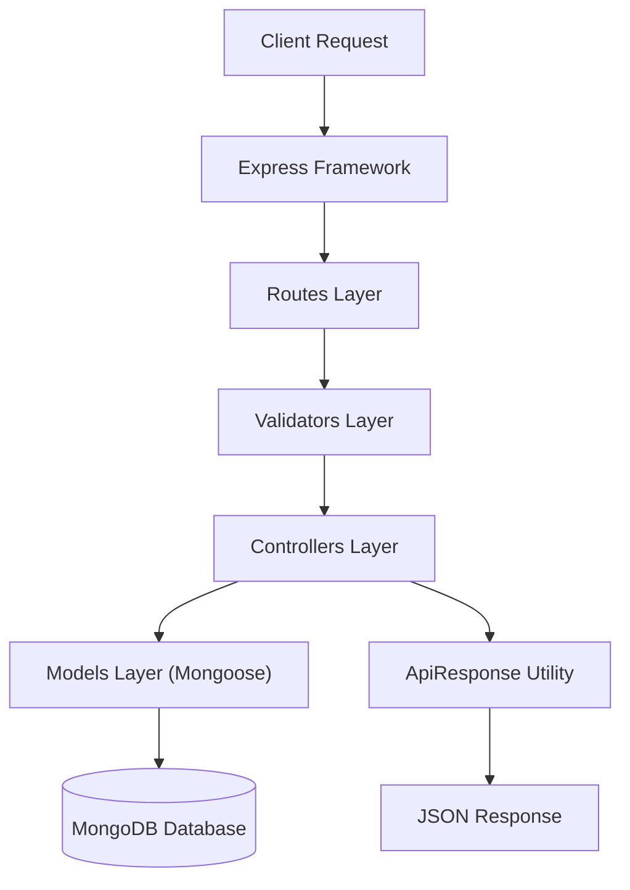
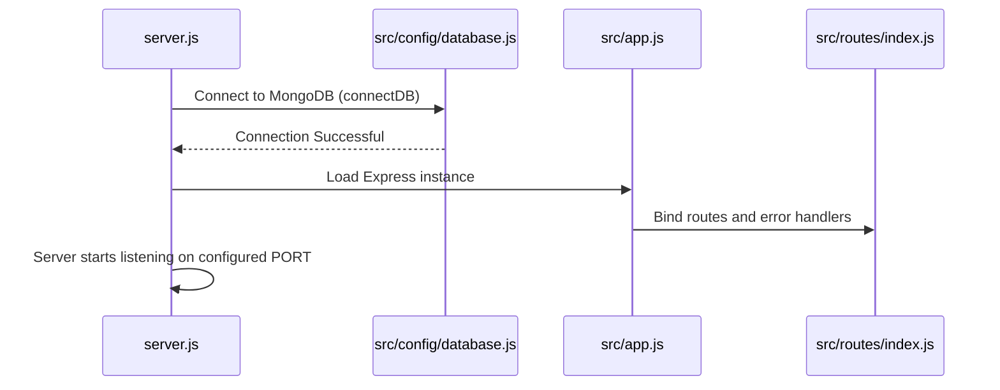
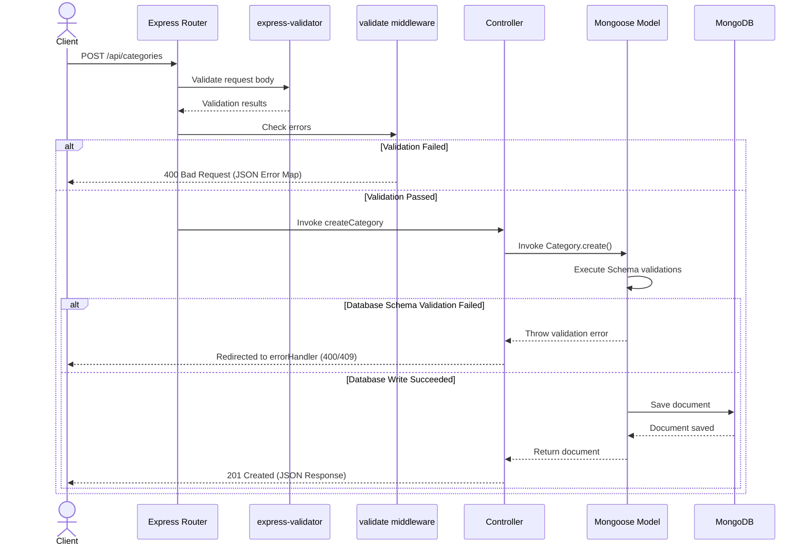
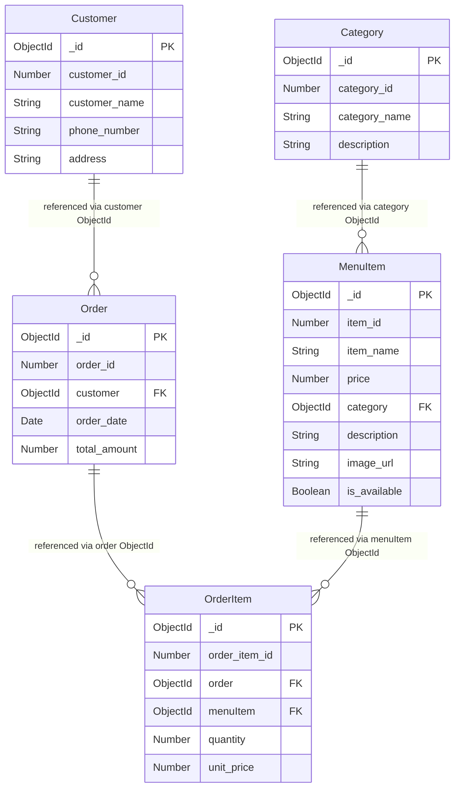
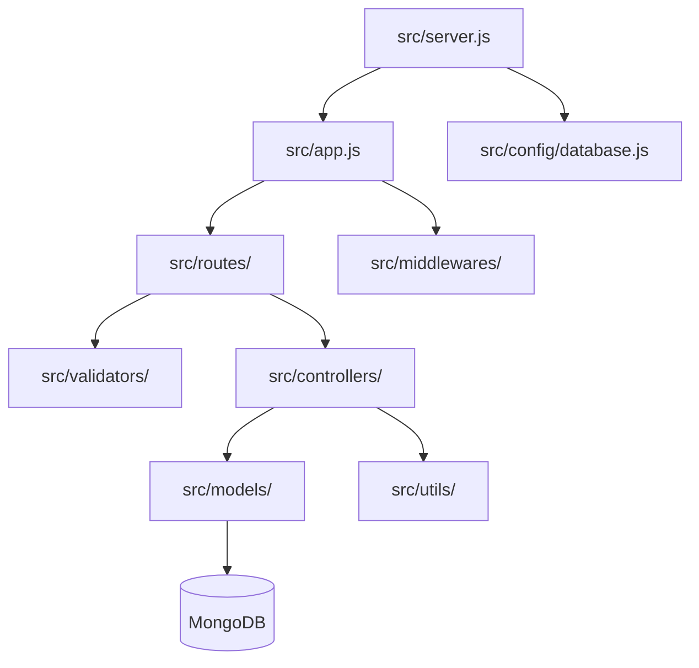
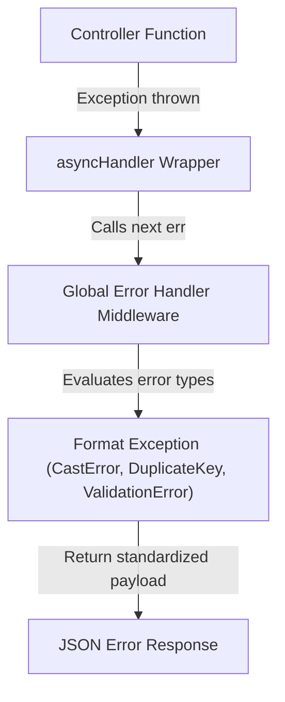
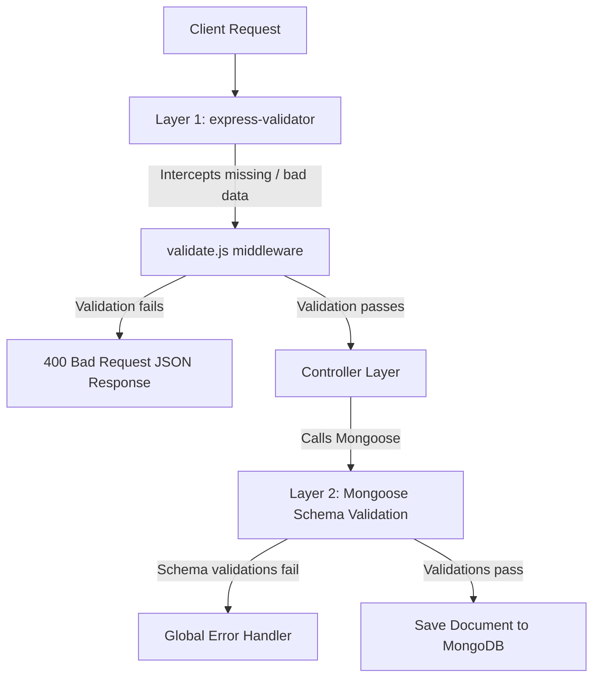
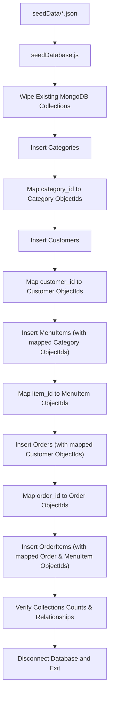

# Restaurant API Architecture

This document visually details the architecture, startup flows, request lifecycles, databases relationships, and directory dependencies of the **Restaurant API** application.

---

## Section 1: High-Level Architecture

The API implements a decoupled multi-layered architecture where each concern is isolated into dedicated modules.

### Flow Breakdown
- **Client Request**: Initiated by a web client or API tool.
- **Express**: Parses requests, applies CORS, logs details, and matches endpoints.
- **Routes**: Directs URL paths to the appropriate middlewares and controller hooks.
- **Validators**: Structural checks are executed before reaching controller logic.
- **Controllers**: Invokes model operations and implements relational integrity validation.
- **Models**: Maps documents to JavaScript entities and writes to MongoDB.
- **ApiResponse**: Builds standard JSON structures.

---

## Section 2: Application Startup Flow

The server boots in a deterministic, sequential execution starting from `server.js`.

### Stage Explanations
1. **Uncaught Exceptions Handler**: Catches any synchronous initialization failures.
2. **Environment Variables Loading**: Load values (e.g. `MONGO_URI`, `PORT`) via `dotenv`.
3. **Database Connection**: Calls Mongoose connection handler. Server listening is blocked until the connection succeeds.
4. **App Initialization**: Initializes Express middlewares (CORS, Morgan, JSON).
5. **Listen**: Listens on the designated PORT.

---

## Section 3: Request Lifecycle

This sequence diagram charts a single request traversing the API.

---

## Section 4: Database Relationships

Relationships use MongoDB ObjectId references (`ref` keyword). Preserved SQL integer IDs are stored only as informational fields.

---

## Section 5: Folder Dependency Graph

The directory dependency graph flows unidirectionally from entry controllers down to databases models. Middlewares and utilities act as support libraries.

---

## Section 6: Error Handling Flow

Centralized error handling routes all caught exceptions to a single formatting middleware.

---

## Section 7: Validation Flow

Input validation is structured in two separate barriers to guarantee maximum database integrity.

---

## Section 8: Seed Process

The seeding database script parses original JSON files and maps relational structures in logical order to prevent orphan keys.

